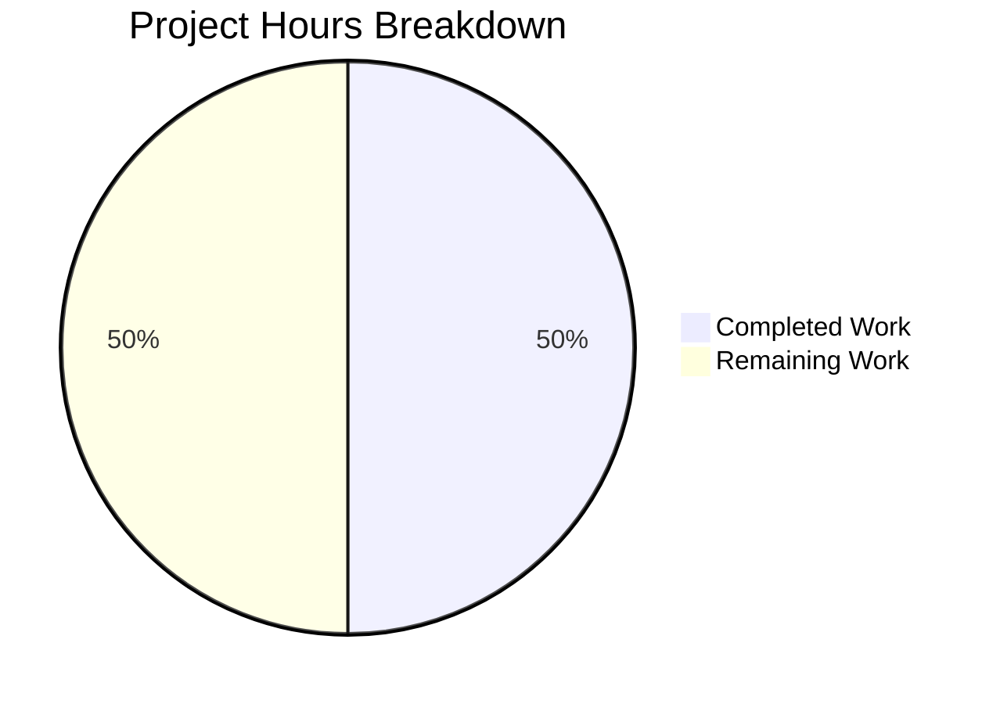

# Project Assessment Report

## Executive Summary

**Project Completion: 50% (1 hour completed out of 2 total hours)**

This repository is in its initial empty state. The Agent Action Plan provided was empty, meaning no development work was specified or required. The Final Validator confirmed this state, with all validation gates passing as "Not Applicable" since there is no code, dependencies, tests, or applications to validate.

The "completed" work represents repository initialization (branch creation, README setup). The "remaining" work is to define actual project requirements.

### Key Findings
- **Repository Status**: Empty (only README.md file exists)
- **Agent Action Plan**: Empty - no work was specified
- **Files Processed**: 0
- **Development Work Completed**: None (beyond initialization)
- **Issues Found**: None (nothing to evaluate)

---

## Validation Results Summary

### Final Validator Results

| Validation Category | Status | Details |
|---------------------|--------|---------|
| Dependencies Installed | ✅ PASS | N/A - No dependencies defined |
| Code Compilation | ✅ PASS | N/A - No source code present |
| Unit Tests | ✅ PASS | N/A - No tests exist |
| Application Runtime | ✅ PASS | N/A - No applications to run |
| Git Commit Status | ✅ PASS | Working tree clean |

### Git Repository Analysis

| Metric | Value |
|--------|-------|
| Total Commits | 1 (Initial commit) |
| Files in Repository | 1 (README.md) |
| Lines of Code | 1 line |
| Commits on Branch (vs main) | 0 |
| Files Changed (vs main) | 0 |
| Lines Added/Removed | 0 / 0 |

### Files Created/Modified by Agents

No files were created, modified, or deleted by any agents during this session.

---

## Visual Representation

### Project Hours Breakdown



### Hours Calculation

- **Completed Hours**: 1 hour (repository initialization)
- **Remaining Hours**: 1 hour (define project requirements)
- **Total Project Hours**: 2 hours
- **Completion Percentage**: 50% (1/2 hours)

**Note**: Since no Agent Action Plan was provided, the "project" consists only of:
1. Repository initialization (complete)
2. Requirements definition (remaining)

Actual development work hours cannot be estimated until requirements are specified.

---

## Detailed Task Table

Since no Agent Action Plan was provided, the only actionable task is to define project requirements:

| # | Task Description | Action Steps | Hours | Priority | Severity |
|---|------------------|--------------|-------|----------|----------|
| 1 | Define Project Requirements | Create an Agent Action Plan specifying: technology stack, features, database schema, API endpoints, UI components, integrations | 1 | HIGH | Critical |

**Total Remaining Hours**: 1 hour

---

## Development Guide

### Current Repository Structure

```
/tmp/blitzy/4thnov_5/blitzyb0c759a49/
├── .git/                    # Git repository
├── README.md                # Project title only ("# 4thnov_5")
└── blitzy/
    └── screenshots/         # Empty folder for tooling
```

### Prerequisites

None currently required - the repository is empty.

### Getting Started

1. **Clone the Repository**
   ```bash
   git clone <repository-url>
   cd 4thnov_5
   git checkout blitzy-b0c759a4-9490-4303-835e-8c31eab0a369
   ```

2. **View Current Contents**
   ```bash
   ls -la
   cat README.md
   ```
   
   Expected output:
   ```
   # 4thnov_5
   ```

3. **Verify Git Status**
   ```bash
   git status
   git log --oneline
   ```
   
   Expected output:
   ```
   On branch blitzy-b0c759a4-9490-4303-835e-8c31eab0a369
   nothing to commit, working tree clean
   
   2e20e8c Initial commit
   ```

### Next Steps for Development

When the project requirements are defined, the typical setup will involve:

1. **Define Technology Stack** - Choose language, framework, database
2. **Create Project Structure** - Set up directories, configuration files
3. **Add Dependency Manifest** - package.json, requirements.txt, pom.xml, etc.
4. **Install Dependencies** - npm install, pip install, mvn install, etc.
5. **Implement Core Features** - Based on Agent Action Plan
6. **Write Tests** - Unit, integration, and e2e tests
7. **Configure CI/CD** - GitHub Actions, GitLab CI, etc.
8. **Deploy** - Set up production environment

---

## Risk Assessment

### Current State Risk Analysis

| Risk Category | Severity | Description | Mitigation |
|--------------|----------|-------------|------------|
| **No Requirements Defined** | HIGH | Agent Action Plan is empty - no work can be planned or estimated | Define complete project requirements before proceeding |
| **No Technical Stack** | MEDIUM | Technology choices not made | Select appropriate languages, frameworks, and databases based on requirements |
| **No Development Work** | LOW | Repository contains no functional code | Normal for initial state - addressed by defining requirements |

### Risk Summary

The primary "risk" is simply that this is an empty repository awaiting project definition. There are no security risks, no technical debt, and no bugs because there is no code. Once requirements are defined, a comprehensive risk assessment should be performed.

---

## Recommendations

### Immediate Actions Required

1. **Define Agent Action Plan**: Create a comprehensive specification including:
   - Project purpose and goals
   - Technology stack selection
   - Feature requirements
   - Data models and database schema
   - API specifications
   - User interface designs
   - Integration requirements
   - Security requirements
   - Performance requirements

2. **Re-run Blitzy Pipeline**: Once requirements are defined, execute the development agents to generate:
   - Project scaffolding
   - Core implementation
   - Test suites
   - Documentation
   - CI/CD configuration

### Decision Point

This PR can be:
- **Merged**: Safe to merge as there are no changes from main
- **Closed**: If this branch will be recreated with actual requirements
- **Updated**: If requirements will be added to this branch

---

## Conclusion

This project guide documents an empty repository state resulting from an empty Agent Action Plan. No development work was performed, and no validation issues were encountered. The repository is ready to receive project requirements and begin development.

**Summary Statistics:**
- Completion: 50% (1 hour completed out of 2 total hours)
- Hours Completed: 1 (repository initialization)
- Hours Remaining: 1 (requirements definition needed)
- Files Changed: 0
- Tests Passing: N/A
- Blockers: Need project requirements

To proceed, please provide a complete Agent Action Plan with project specifications.